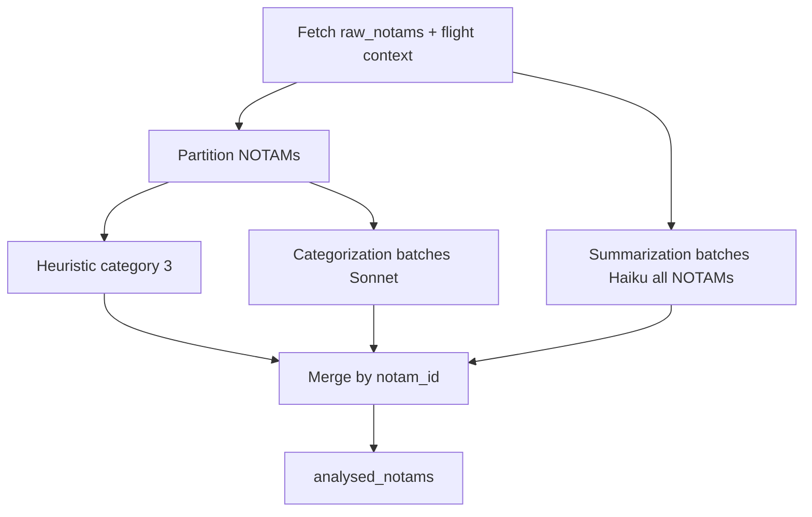

# NOTAM LLM analysis

Split-agent NOTAM analysis for a confirmed flight plan job: Sonnet categorizes, Haiku summarizes, with heuristic category-3 shortcuts for high-confidence topics.

See also: [Begin analysis](../endpoints/v1-jobs-begin-analysis.md), [Analysis context](analysis-context.md), [NOTAM topic classification](notam-topic-classification.md), and [NOTAM heuristic classification](notam-heuristic-classification.md).

## Flow

1. **Sync** (`POST /v1/jobs/analysis`): validate job, build flight context (no NOTAMs), set `processing_analysis`, return `{ "response_begun": true }`.
2. **Background** (`run_analysis_task`):
   - Build flight context and fetch `raw_notams` (including `topic` and `topic_confidence`)
   - Partition NOTAMs into heuristic category candidates vs agent categorization candidates
   - **Concurrent legs** via `analyze_notam_job`:
     - **Categorization (Sonnet):** topic-grouped batches for agent rows only; category-only JSON output
     - **Summarization (Haiku):** flat batches across **all** NOTAMs; condensed payload without flight context
   - Merge category + summary by `notam_id`
   - On missing IDs per leg, set `retrying` and re-run only the failing leg (category missing → same topic batch; rejected → `MISC`; summary missing → summary-only Haiku retry)
   - Persist `analysed_notams` → set `finished` or `partial_finish`



## Module layout

| Module | Role |
|---|---|
| [`app/services/analysis_service.py`](../../app/services/analysis_service.py) | Sync validation and status transition |
| [`app/services/analysis_task.py`](../../app/services/analysis_task.py) | Background pipeline orchestration and per-leg retry |
| [`app/services/notam_analyzer.py`](../../app/services/notam_analyzer.py) | Partitioning, batching, dual agents, merge |
| [`app/services/notam_heuristic_category.py`](../../app/services/notam_heuristic_category.py) | Analysis-time category-3 eligibility |
| [`app/services/notam_topic_prompts.py`](../../app/services/notam_topic_prompts.py) | Topic → categorization system prompt registry |
| [`app/services/notam_prompts/summary.py`](../../app/services/notam_prompts/summary.py) | Haiku summarization system prompt |
| [`app/services/notam_prompts/`](../../app/services/notam_prompts/) | Per-topic categorization system prompt content |
| [`app/repositories/analysed_notam_repository.py`](../../app/repositories/analysed_notam_repository.py) | Bulk insert/update into `analysed_notams` |

## Categorization leg (Sonnet)

NOTAMs requiring LLM categorization are grouped by `raw_notams.topic` (defaulting null to `MISC`), then chunked into groups of `NOTAM_ANALYSIS_BATCH_SIZE` (default 10) within each topic.

Payload includes full flight context:

```json
{ "flight": { ... }, "notams": [ ... ] }
```

Structured output is **category only** — `{ "notam_id", "category" }`. Specialist agents return `{ "results": [...], "rejected_notam_ids": [...] }`. Rejected NOTAMs retry with the general (`MISC`) agent.

Heuristic-eligible NOTAMs skip this leg entirely; see [heuristic classification](notam-heuristic-classification.md).

## Summarization leg (Haiku)

All NOTAMs are summarized in flat batches (not topic-grouped). Payload is condensed — no flight context:

```json
{ "notams": [ { "title", "notam_id", "q", "a", "b", "c", "d", "e", "f", "g" } ] }
```

Output: `{ "notam_id", "summary" }` per NOTAM.

Both legs run concurrently inside `analyze_notam_job` before merge.

## Claude settings

| Setting | Default | Leg |
|---|---|---|
| `NOTAM_ANALYSIS_MODEL` | `claude-sonnet-4-6` | Categorization |
| `NOTAM_ANALYSIS_BATCH_SIZE` | `10` | Categorization (initial pass) |
| `NOTAM_ANALYSIS_RETRY_BATCH_SIZE` | `5` | Categorization retry batches |
| `NOTAM_ANALYSIS_MAX_TOKENS` | `18000` | Categorization |
| `NOTAM_ANALYSIS_MAX_CONCURRENCY` | `4` | Per-leg thread pools |
| `NOTAM_ANALYSIS_INPUT_COST_PER_M` | `3.0` USD | Categorization |
| `NOTAM_ANALYSIS_OUTPUT_COST_PER_M` | `15.0` USD | Categorization |
| `NOTAM_SUMMARY_MODEL` | `claude-haiku-4-5` | Summarization |
| `NOTAM_SUMMARY_BATCH_SIZE` | `20` | Summarization (initial pass) |
| `NOTAM_SUMMARY_RETRY_BATCH_SIZE` | `10` | Summarization retry batches |
| `NOTAM_SUMMARY_MAX_TOKENS` | `8000` | Summarization |
| `NOTAM_SUMMARY_INPUT_COST_PER_M` | `1.0` USD | Summarization |
| `NOTAM_SUMMARY_OUTPUT_COST_PER_M` | `5.0` USD | Summarization |

Categorization uses adaptive thinking. Summarization sets `thinking: disabled`.

## Retry handling

| Leg | Missing means | Retry strategy |
|---|---|---|
| Categorization | ID omitted from category output | Same topic batch; rejected → `MISC` |
| Summarization | ID omitted from summary output | Summary batches only (Haiku, condensed payload) |

Before retrying, successfully completed fields are inserted and pending NOTAMs get placeholder rows (`category` and/or `summary` may be `null`). Retry updates merge partial fields without overwriting the other leg.

## Pipeline stage logs

| `stage_name` | Metadata |
|---|---|
| `build_context_object` | `departure_airfield_full_data_found`, `arrival_airfield_full_data_found`, `aircraft_full_data_found` |
| `notam_analysis` | `total_notams`, `heuristically_classified_notams`, `summarisation_batches`, `categorisation_batches`, `summarisation_batch_sizes`, `categorisation_batch_sizes`, `token_limit_hit`, `slowest_batch_ms`, `summarize_input_tokens`, `categorize_input_tokens`, `summarize_output_tokens`, `categorize_output_tokens`, `est_cost`, `retried_summary_notam_ids`, `retried_category_notam_ids` |

**Full data found** rules:

- Airfield: `iso_country` and `length_ft` both non-null (runway row matched).
- Aircraft: `icao_wtc` non-null (linked `aircraft_reference` row or `fleet_aircraft.custom_data`).

## Persistence

Results are written to `analysed_notams`:

| Column | Source |
|---|---|
| `anaysis_job_id` | Job UUID (DB column name as stored) |
| `flight_plan_id` | Request flight plan UUID |
| `notam_id` | `raw_notams.id` (bigint FK) |
| `category` | Merged result (`null` until available) |
| `summary` | Merged result (`null` until available) |
| `did_error` | `false` on insert; set `true` when retry still fails for that NOTAM |
| `created_at` | Row insert timestamp (DB default) |

LLM `notam_id` strings (ICAO format) are mapped to `raw_notams.id` before insert. Unknown IDs fail the job.

## Job status

| Outcome | `analysis_jobs.status` |
|---|---|
| All NOTAMs fully analysed (category + summary, including after retry) | `finished` |
| Retry completes but some NOTAMs still missing on either leg | `partial_finish` |
| Retry in progress | `retrying` |
| Unrecoverable error (API failure, unknown NOTAM id, etc.) | `failed` (+ `error_message`) |

## Tests

```bash
pytest tests/unit/test_notam_analyzer.py \
       tests/unit/test_notam_heuristic_category.py \
       tests/unit/test_analysis_task.py \
       tests/unit/test_pipeline_stage_metadata.py \
       tests/integration/test_begin_analysis_endpoint.py -v
```
